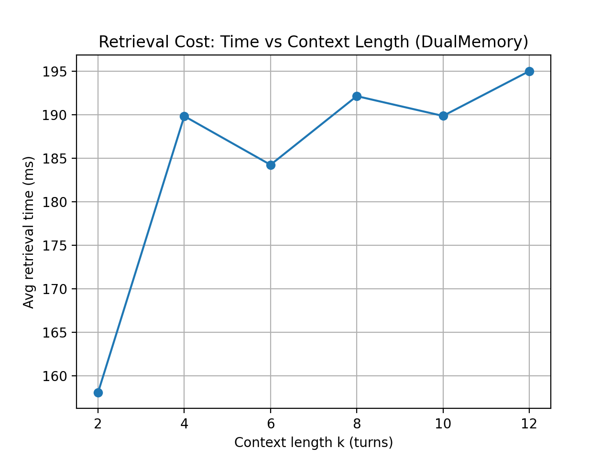

# DualMemory: A Structured Memory Framework for Conversational Recall

This project implements and evaluates a dual-memory (STM + LTM) framework for conversational recall.  
The goal is to analyze how structured memory mechanisms affect accuracy and computational efficiency in multi-turn dialogue systems.
Full technical report available in report.pdf

---

## Project Overview

In multi-turn conversations, relevant information may appear far earlier than the recent context window.

This project compares:

- **Sliding Window**: Uses only the last *k* turns as context.
- **DualMemory (STM + LTM)**:
  - Short-Term Memory (recent turns)
  - Long-Term Memory (retrieval-based memory storage)
  - Memory strength mechanism (frequency boost, retrieval reinforcement, decay)

The system evaluates recall performance using the DailyDialog dataset.

---

## Dataset

The dataset is automatically downloaded inside the notebook using `gdown`.

No manual upload is required.

---

## Evaluation Metrics

The framework is evaluated across multiple context lengths (k = 2,4,6,8,10,12) using:

- Accuracy
- Retrieval Cost (ms)
- Token Efficiency (Accuracy per token)

---

## Results

### Accuracy vs Context Length

### Retrieval Cost vs Context Length

### Token Efficiency vs Context Length

### Interpretation

DualMemory achieves comparable or slightly improved accuracy relative to the sliding-window baseline across different context lengths.
Although retrieval introduces additional computational overhead, the cost increases initially but then plateaus, remaining relatively stable as context length grows.
Token efficiency decreases as context length increases for both methods, illustrating the trade-off between context expansion and computational efficiency.
These results suggest that structured memory modeling provides a viable alternative to simply enlarging the context window.

---

## How to Run (Google Colab recommended)

1. Open `DualMemory_DailyDialog.ipynb` in Google Colab.
2. Run all cells.
3. The notebook will automatically download the dataset.
4. Plots and CSV results will be generated under the `results/` folder.

---

## Output Files

After execution, the following files are generated:

- `results/curve_accuracy.png`
- `results/curve_cost.png`
- `results/curve_efficiency.png`
- `results/curve_results.csv`
- `results/results_dualmemory.csv`

---

## Key Concepts

- Short-Term Memory (STM)
- Long-Term Memory (LTM)
- Memory consolidation
- Strength reinforcement
- Exponential decay
- Retrieval-based recall
- Accuracy–Efficiency trade-offs

---

## Author

TZU-YING, CHANG
2026
